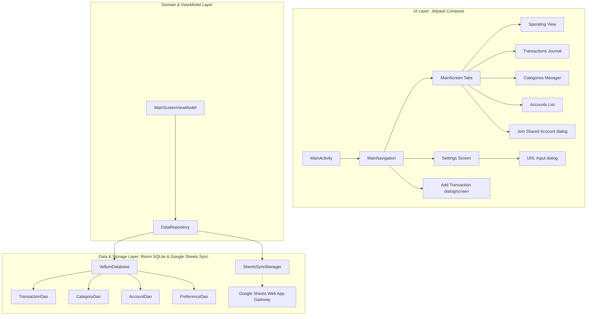

# Technical Architecture & System Specifications: Vellum (Android App)

> [!NOTE]
> For active session context, screenshot analysis summary, and implementation checklists, see **[HANDOVER.md](HANDOVER.md)**.

Vellum is a native Android spending tracker app built using modern Android development practices (Kotlin, Jetpack Compose, Room SQLite database, and Kotlin Coroutines/Flow). It replicates the chalkboard-style Spending tracker and parchment-style transaction journals shown in the sample screenshots.

---

## 1. System Architecture Overview

Vellum follows a clean architecture pattern for Android, structured into three layers:

### Decoupling & Sync Strategy
The UI controls consume flow streams exposed by the `DataRepository` via ViewModels. Storage operations are local-first. When users are offline/logged out, data is saved locally inside Room DB.

When signed in via Google and configured with a Google Sheets Web App Sync URL:
1. Operations write locally to the Room SQLite database and mark the record's `isSynced` flag to `false`.
2. A synchronization procedure is triggered automatically in the background (or manually via the top-bar Refresh button).
3. The `SheetsSyncManager` GETs the current sheet state first, then POSTs all un-synchronized local changes to the Google Apps Script Web App (GET-first bidirectional sync).
4. The Web App updates the Google Sheet, merges rows from all active household participants sharing the account, and returns the merged datasets.
5. The local cache is replaced in a single Room database transaction to prevent UI flickering.

### Sync Conflict Resolution Model

Merge priority order (highest wins):

| Priority | Rule | Mechanism |
|----------|------|-----------|
| 1 | Tombstone wins over live row | `deleted_accounts` / `deleted_categories` / `deleted_transactions` preference strings |
| 2 | Last-Write-Wins for edits | `updatedAt` timestamp field *(planned — not yet in schema)* |
| 3 | Local-new row wins | Unsynced local UUID rows not present on sheet → POSTed |
| 4 | Remote-new row wins | Sheet rows not present locally → inserted on GET |

**Preferences**: Local always wins when set by the user. On a fresh device install, sheet values are pulled in first. Some preferences are device-local (UI), others are syncable (financial/cross-device).

| Preference Key | Syncs to Sheet? | Reason |
|---|---|---|
| `sheets_url` | ✅ Yes | Must be identical across devices |
| `currency_symbol` | ✅ Yes | Financial data consistency |
| `auto_backup` | ✅ Yes | Controls server-side Apps Script trigger |
| `budget_mode` | ✅ Yes | Financial behaviour |
| `dark_theme` | ❌ No | Device UI preference |
| `tabs_position` | ❌ No | Device UI preference |
| `summary_font` | ❌ No | Device UI preference |

### Shared Account Rules

- Only the `ownerEmail` may **delete** a shared account.
- Non-owners may only **leave** (removes them from the `shares` tab on the sheet; account and all its transactions remain intact for other members).
- An account that has linked transactions is **never hard-deleted** from the sheet. It is tombstoned (`isDeleted=true`) so dangling `accountId` references in transactions resolve gracefully.
- Before allowing an owner delete, the Apps Script checks the `shares` tab. If other members are still active, the delete is blocked and an error is returned.

### Known Sync Gaps (Planned Fixes — see Section 7)

| Gap | Affected File(s) | Risk |
|-----|-----------------|------|
| Non-owner "Leave" and owner "Delete" call the same `deleteAccount` path — no logic branching | `AddAccountDialog.kt`, `MainScreenViewModel.kt` | 🔴 High |
| `deleteAccount` cascades and hard-deletes all linked transactions — including for non-owners leaving | `DataRepository.kt` | 🔴 High |
| `deleted_accounts` tombstone strings are wiped by `clearLocalCache()` on sign-out | `DataRepository.kt` | 🔴 High |
| No `updatedAt` column on any entity — edit conflicts resolved by last-sync-wins (not LWW) | `Entities.kt` | 🟡 Medium |
| No `isDeleted` tombstone column — deletes tracked only via preference strings | `Entities.kt` | 🟡 Medium |
| Apps Script does append (not upsert) on POST — partial sync retry creates duplicate sheet rows | `Code.gs` | 🔴 High |
| Orphaned `accountId` in transactions shows blank/crash if account row deleted between syncs | All transaction display composables | 🟡 Medium |

---

## 2. Local Database Schema (Room Entities)

The local SQLite database (`vellum.db`) contains four entity tables. Primary Keys are represented as UUID Strings to allow safe multi-user offline creation without key conflicts.

### 1. `transactions` (TransactionEntity)
Stores the ledger transaction entries.

| Column | SQLite Type | Description |
| :--- | :--- | :--- |
| `id` | TEXT (Primary Key) | Unique UUID String |
| `amount` | REAL | Absolute monetary value |
| `type` | TEXT | `EXPENSE` or `INCOME` |
| `categoryId` | TEXT | Linked category UUID |
| `categoryName` | TEXT | Cache of category name |
| `accountId` | TEXT | Linked account UUID |
| `accountName` | TEXT | Cache of account name |
| `note` | TEXT | Transaction description note |
| `timestamp` | INTEGER | Time of transaction (epoch ms) |
| `userEmail` | TEXT | Creator email address (nullable) |
| `isSynced` | INTEGER (Boolean) | Synchronization status flag |

### 2. `categories` (CategoryEntity)
Stores categories. It is pre-populated with defaults.

| Column | SQLite Type | Description |
| :--- | :--- | :--- |
| `id` | TEXT (Primary Key) | Unique UUID String |
| `name` | TEXT | Display name |
| `type` | TEXT | `EXPENSE` or `INCOME` |
| `icon` | TEXT | Name of icon resource |
| `isDefault` | INTEGER (Boolean) | Flag indicating a default app category |
| `chartColor` | TEXT | Hex color string |
| `userEmail` | TEXT | Creator email address (nullable) |
| `isSynced` | INTEGER (Boolean) | Synchronization status flag |

### 3. `accounts` (AccountEntity)
Stores active user/household accounts.

| Column | SQLite Type | Description |
| :--- | :--- | :--- |
| `id` | TEXT (Primary Key) | Unique UUID String |
| `name` | TEXT | Account name |
| `icon` | TEXT | Icon resource name |
| `isDefault` | INTEGER (Boolean) | Flag indicating primary default account |
| `color` | TEXT | Hex color string |
| `shareCode` | TEXT | 6-character random household code (nullable) |
| `ownerEmail` | TEXT | Creator owner email address (nullable) |
| `userEmail` | TEXT | Associated user email address (nullable) |
| `isSynced` | INTEGER (Boolean) | Synchronization status flag |

### 4. `preferences` (PreferenceEntity)
Stores persistent settings preferences.

| Column | SQLite Type | Description |
| :--- | :--- | :--- |
| `key` | TEXT (Primary Key) | Preference key (e.g. `sheets_url`, `tabs_position`) |
| `value` | TEXT | Preference string value |

---

## 3. UI Aesthetics & Themes

The application dynamically renders two distinct themes matching the visual style of the sample screenshots:

### A. Chalkboard Theme (Used in the Spending Tab)
* **Background**: Slate charcoal dark gray (`#2A2B2D` with chalk texture grain).
* **Typography**: Chalk-drawn handwriting font (Google Fonts: "Patrick Hand" loaded via `patrick_hand.ttf`).
* **Accents**:
  * Income Text: Chalk green (`#8FCE5E`).
  * Expense Text: Chalk red (`#F07D7D`).
  * Balance Text: Chalk blue (`#87CEEB`).
  * Action Buttons: Slate gray fill with white chalk-outline borders.
* **Segmented Progress Bar**: Visual balance indicator (green portion representing relative income share, red representing expense share).

### B. Parchment Theme (Used in Transactions, Categories, Accounts, and Settings)
* **Background**: Slate charcoal dark gray (`#2A2B2D` with chalk grain, globally aligned with chalkboard aesthetics).
* **Typography**: Chalk-drawn handwriting font (`patrick_hand.ttf`).
* **Lines / Borders**: Dashed chalk-drawn borders and separators using dark gray (`#8B8C8D`).

### C. Landscape Reports (Chalkboard Canvas charts)
* **Orientation Redirect**: When the device orientation shifts to landscape, the application redirects the user to the `LandscapeReports` dashboard.
* **Canvas Charts**:
  - **Pie Chart**: Visualizes categories of expense distributions.
  - **Bar Chart**: Groups categories in a paginated bar chart (5 items per page) with centered layout and a clean baseline, using top-left page selectors (`-` and `+`).
  - **Cash Flow Line Chart**: Offers selector options (`D`, `W`, `M`, `Y`) to graph Income vs Expense over Daily, Weekly, Monthly, or Yearly intervals.
* **Layout Constraints**: The landscape reports utilize the screen's safe boundaries, preserving the default system status and navigation bar visibility.

---

## 4. Settings Reference Specifications

The settings pane contains:
1. **Spending**:
   * *Time Period*: Show spending based on Daily, Weekly, Monthly (Default), or Yearly intervals.
   * *Budget Mode*: Toggle budget settings.
   * *Carry Over*: Carry balance over between periods.
   * *Hide Future Transactions*: Hide future entries.
2. **Automatic Syncing**:
   * *Dropbox Sync*: Authenticate and sync with Dropbox storage.
   * *Google Sheet Sync URL*: Paste deployed Google Apps Script Web App gateway URL.
3. **User Interface**:
   * *Dark Theme*: Force global dark theme.
   * *Show Transaction Note*: Display descriptions in transaction lists.
   * *Currency Symbol*: Currency symbol settings.
   * *Summary Font*: Toggle summary screen between "Chalk" and standard font.
   * *Category Icon Style*: Outlined or filled icons.
   * *Tabs Position*: Top (default) or bottom.
4. **General**:
   * *Reminders*: Notification preferences.
   * *Auto Backup*: Automated database exporting.
   * *Passcode*: Toggle PIN code authentication before opening the app.

---

## 5. Advanced Features & Developer Utilities

### 1. Usage-Based Category Sorting
To optimize the user experience during entry input, both the **Categories Tab** and the **Add Transaction** dialog sort category options dynamically:
- Collects the complete transaction history flow (`allTransactions`).
- Maps each category to its usage count in existing transactions.
- Sorts categories descending by usage frequency, placing the most active categories at the top.

### 2. Settings-Driven Spreadsheet Backups
Google Apps Script (`Code.gs`) integrates directly with the synced user preference `auto_backup`:
- **Trigger Management (`manageBackupTrigger`)**: Runs during sheet setup and data synchronization. If `auto_backup` is enabled (`"On"`) for any user, it dynamically schedules a time-driven trigger daily at 11:30 PM. If disabled (`"Off"`), it deletes the trigger to save Apps Script quota.
- **Daily Backup (`runDailyBackup`)**: Automatically copies all active sheet ranges (`transactions`, `categories`, `accounts`, `preferences`, `shares`, `users`) to backup sheets (prefixed with `backup_`).

### 3. Debug Mode Clean-Slate
For testing and development velocity, the app enforces a clean slate on debug installations:
- On the first run of a debug build, the app triggers a sign-out of the Google account and completely clears and re-seeds the local SQLite Room database, ensuring that developers start from a pristine onboarding state.
- Checked using a `"first_run_debug"` flag in Android `SharedPreferences`.

### 4. Apps Script Manual Reset Utility
A manual database reset utility `resetSpreadsheet()` is provided in the Apps Script backend for manual testing. When executed from the Apps Script editor, it drops custom sheets, resets the standard tables to empty states with schema headers, and deletes all active triggers.

---

## 6. Version Control & Repository

### Repository
- **GitHub**: [github.com/foolchauhan/vellum](https://github.com/foolchauhan/vellum)
- **Remote protocol**: SSH (`git@github.com:foolchauhan/vellum.git`)

### Branch Model

| Branch | Purpose |
|---|---|
| `main` | Stable production-ready code. No direct commits. |
| `develop` | Integration branch for completed features. No direct commits. |
| `release/release-x.y.z` | Frozen release snapshots. No direct commits. |
| `feature/name` | Active development — branch from `develop` |
| `fix/name` | Bug fixes — branch from `develop` |
| `chore/name` | Non-functional changes — branch from `develop` |

### Rules
1. **No direct commits** to `main`, `develop`, or `release/*` — enforced via GitHub Branch Protection Rules.
2. All changes require a **Pull Request** and **approval** before merging.
3. To move changes from `develop` into a `release/*` branch: create a branch from the release branch, merge develop into it, resolve conflicts, push, open PR.
4. See [AGENT.md](AGENT.md) — Section 4 for the complete step-by-step workflow.

---

## 7. Sync Reliability & Conflict Handling (Implemented — Phase 7)

We have fully implemented the conflict resolution and sync reliability plan on the `feature/sync-reliability-and-conflict-handling` branch.

### 7.1 Schema Changes — `Entities.kt` (Room DB Migration Version 3 → 4)
* **Added columns** to `TransactionEntity`, `CategoryEntity`, and `AccountEntity`:
  * `updatedAt` (`Long`): Last-Write-Wins (LWW) timestamp.
  * `isDeleted` (`Boolean`): Soft-delete tombstone flag.
  * `deletedAt` (`Long?`): Deletion timestamp.

### 7.2 DAO Queries & Soft-Delete — `Daos.kt`
* Filtered out `isDeleted = 1` rows from active UI flows.
* Added `markDeleted` soft-delete update queries.
* Retained raw `@Delete` calls only for cache clearing and sync replacement.

### 7.3 Repository & ViewModel soft-deletes
* Implemented `softDeleteTransaction`, `softDeleteCategory`, and `softDeleteAccount` in `DataRepository`.
* Added `leaveAccount()` (removes local account row only, preserving linked transactions) for non-owner member departures.
* Branched UI delete buttons in `AddEditAccountScreen` on `isOwner`: calls `deleteAccount` if owner, or `leaveSharedAccount` if non-owner member.

### 7.4 Display-Time Joins
* Transactions lists resolve category and account names dynamically at display time using live lists. Falls back to "(Deleted Account)" or the cached column as a safety net if missing.

### 7.5 Idempotency and LWW Sync Gateway
* Switched sync engine (`SheetsSyncManager.kt`) to POST `left_accounts` tombstones and perform standard GET-first LWW merges.
* Updated `Code.gs` to perform upserts by UUID (not appends) on the sheet, making sync requests completely idempotent.
* Implemented owner delete guards in `Code.gs` preventing account deletion if other members are still active.

---

## 8. Full-Screen Refactoring & CSV Bulk Upload (Implemented — Phase 8)

We have refactored all popup dialog forms into dedicated full screens, added category auto-selection, and introduced settings-based CSV bulk upload.

### 8.1 Full-Screen Form Architecture
* Refactored transaction, category, and account Add/Edit popup dialogs into distinct composable screens: `AddEditTransactionScreen`, `AddEditCategoryScreen`, and `AddEditAccountScreen`.
* Switched form routing to utilize `Navigation3` screen transitions.
* Implemented category auto-selection when returning from category creation inside the transaction screen using a reactive `LaunchedEffect` that compares category ID listings.

### 8.2 CSV Bulk Upload & Template Download
* Added `bulkUploadTransactions(csvText)` in `DataRepository` and `MainScreenViewModel` to parse standard templates and auto-create/tag missing categories or accounts.
* Appended an **Advanced Options** section to `SettingsScreen` with **Download CSV Template** (via SAF `CreateDocument`) and **Bulk Upload CSV** (via `GetContent`) options.
* Defined custom Settings row icons for download/upload in `TransactionRow.kt` mapping to `ArrowDownward` and `ArrowUpward` Material vectors.

### 8.3 Spending Tab breakdown & Rotated Labels
* Restructured vertical `SpendingTab` into a scrollable container with sticky headers and action buttons. Added a **Spending by Category** list showing colored category expense breakdowns for the selected account.
* Implemented an inline **category color collision resolver** that substitutes duplicate colors from a pool of distinct colors, ensuring active categories have unique colors on both vertical and landscape charts.
* Increased bottom canvas padding in `BarChartCanvas` to `70.dp` and rotated category labels by `45 degrees` using `withTransform` to resolve text overlapping.
